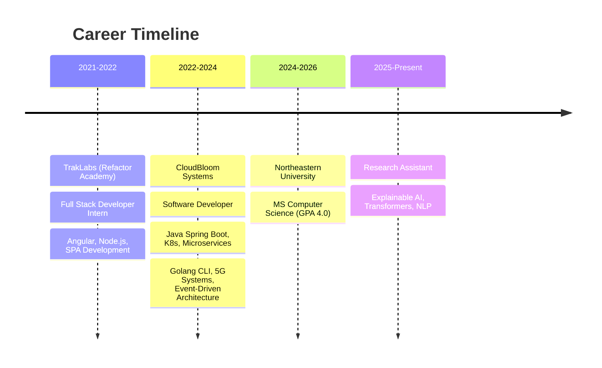

<div align="center">

<!-- Animated Header -->


<!-- Typing Animation -->
[](https://git.io/typing-svg)

<!-- Social Badges -->
<p>
<a href="https://linkedin.com/in/Kkendre"></a>
<a href="mailto:karankendre.app@gmail.com"></a>
<a href="https://github.com/KaranKendre11"></a>
<a href="https://leetcode.com/u/mvpcreed/"></a>
</p>


</div>

---

## 🧬 About Me

```python
class KaranKendre:
    def __init__(self):
        self.name = "Karan Kendre"
        self.location = "San Jose, CA 🌉"
        self.education = "MS Computer Science @ Northeastern University"
        self.gpa = "4.0 / 4.0 ⭐"
        self.current_role = "Research Assistant - Explainable AI"
        
        self.interests = [
            "Distributed Systems",
            "Explainable AI & LLMs",
            "Quantum Computing",
            "Cloud Architecture"
        ]
        
    def say_hi(self):
        print("Thanks for dropping by! Let's build something amazing together 🚀")

me = KaranKendre()
me.say_hi()
```

---

## 🔬 Current Focus

<table>
<tr>
<td width="50%">

### 🎓 Research Assistant @ Northeastern University
**XAI: Summarization Assistant for Research**
- Fine-tuning transformers (BART, LongT5) for citation-aware paper summarization
- Building explainable AI frameworks with attention visualization
- Layer-wise Relevance Propagation for transparency in LLMs
- Interactive Streamlit-based interpretability tools

</td>
<td width="50%">

### 🌟 Areas of Exploration
- 🔮 **Quantum Computing** - Noise reduction with ML
- 🤖 **Agentic AI** - RAG-powered infrastructure agents  
- ☁️ **Cloud Native** - Kubernetes, Terraform, GCP/AWS
- 🧠 **Computer Vision** - Segmentation & Pattern Recognition

</td>
</tr>
</table>

---

## 💼 Professional Journey



---

## 🛠️ Tech Arsenal

<div align="center">

### Languages


### Backend & Frameworks


### ML / AI


### Cloud & DevOps


### Databases & Messaging


### Quantum Computing


</div>

---

## 🚀 Featured Projects

<div align="center">
<table>
<tr>
<td width="50%">
<h3 align="center">🤖 VibeOPS</h3>
<p align="center">


</p>
<p align="center">RAG-powered AI agent converting user requirements into production-ready GCP infrastructure via Terraform with agentic orchestration, real-time knowledge retrieval, and human oversight.</p>
</td>
<td width="50%">
<h3 align="center">🔮 Quantum Noise Reduction</h3>
<p align="center">


</p>
<p align="center">CNN-based autoencoder reconstructing clean 5-qubit states from noisy density matrices using Google's Cirq. Achieved 0.47 average fidelity improvement.</p>
</td>
</tr>
<tr>
<td width="50%">
<h3 align="center">🌐 WebsiteCloner</h3>
<p align="center">


</p>
<p align="center">LLM-driven web reconstruction using Gemini API with FastAPI backend (<200ms response) and Next.js frontend. 85% structural accuracy in HTML/CSS generation.</p>
</td>
<td width="50%">
<h3 align="center">🛣️ Road Segmentation</h3>
<p align="center">


</p>
<p align="center">U-Net based road segmentation achieving IoU scores of 0.78-0.81 with custom-curated dataset for dynamic road environments.</p>
</td>
</tr>
<tr>
<td width="50%" colspan="2">
<h3 align="center">🔄 <a href="https://github.com/KaranKendre11/Circular-Code-Dependency-Detection-">Circular Code Dependency Detection</a></h3>
<p align="center">


</p>
<p align="center">Intelligent tool for detecting circular dependencies in codebases using graph algorithms. Helps maintain clean architecture by identifying cyclic imports and module dependencies that can lead to build failures and maintenance nightmares.</p>
</td>
</tr>
</table>
</div>

---

## 📊 LeetCode Stats

<div align="center">

<a href="https://leetcode.com/u/mvpcreed/">

</a>

</div>

<div align="center">

### 🏆 Problem Solving Breakdown

| Difficulty | Solved | Beats |
|:----------:|:------:|:-----:|
| 🟢 **Easy** | 124/918 | 93.18% |
| 🟡 **Medium** | 229/1978 | 94.95% |
| 🔴 **Hard** | 45/896 | 90.34% |

</div>

<div align="center">

### 🧠 Top Skills


</div>

---

## 🏆 Achievements & Certifications

<div align="center">

| 📜 Certification | 🏛️ Provider |
|:---------------:|:-----------:|
| Deep Learning Specialization |  |
| ML Specialization |  |
| Generative AI with LLMs |  |
| Quantum Error Correction |  |

</div>

---

## 🎯 What I Bring to the Table

```
┌──────────────────────────────────────────────────────────────────────────┐
│                                                                          │
│  🏗️  SCALABLE SYSTEMS      →  Microservices, Event-Driven, K8s          │
│  🔍  EXPLAINABLE AI        →  Transparency in ML, Attention Viz         │
│  ⚡  PERFORMANCE           →  50-66% latency reduction achievements      │
│  🔧  FULL STACK            →  Backend to CLI to Infrastructure          │
│  🎓  ACADEMIC EXCELLENCE   →  4.0 GPA, Research Publications            │
│  🌐  CLOUD NATIVE          →  GCP, AWS, Terraform, Docker               │
│                                                                          │
└──────────────────────────────────────────────────────────────────────────┘
```

---

<div align="center">

### 💬 Let's Connect!

<p>
<i>"The best way to predict the future is to create it."</i>
</p>

**Open to collaborations on AI/ML research, distributed systems, and quantum computing projects!**

<a href="https://linkedin.com/in/Kkendre">

</a>

</div>

<!-- Footer Wave -->


