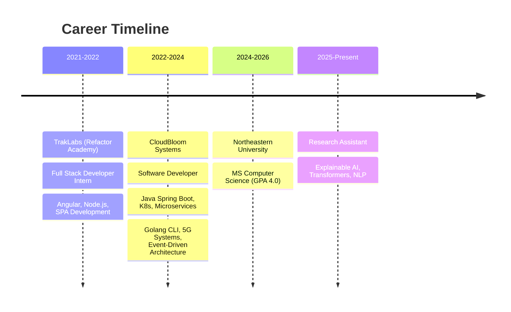

<div align="center">

<!-- Animated Header -->


<!-- Animated Hello -->


<!-- Typing Animation -->
[](https://git.io/typing-svg)

<!-- Social Badges -->
<p>
<a href="https://www.linkedin.com/in/karan-kendre-341213191/"></a>
<a href="mailto:karankendre.app@gmail.com"></a>
<a href="https://github.com/KaranKendre11"></a>
<a href="https://scholar.google.com/citations?user=TSzE3WkAAAAJ&hl=en"></a>
<a href="https://leetcode.com/u/mvpcreed/"></a>
</p>


</div>


##  About Me


```python
class KaranKendre:
    def __init__(self):
        self.name = "Karan Kendre"
        self.location = "San Jose, CA 🌉"
        self.education = "MS Computer Science @ Northeastern University"
        self.gpa = "4.0 / 4.0 ⭐"
        self.current_role = "Research Assistant - Explainable AI"
        
        self.interests = [
            "LLMs & Agentic AI",
            "Distributed Systems",
            "Deep Learning & Computer Vision",
            "Cloud Architecture",
            "Quantum Computing"
        ]
        
    def say_hi(self):
        print("Thanks for dropping by! Let's build something amazing together 🚀")

me = KaranKendre()
me.say_hi()
```

<br clear="both"/>


##  Current Focus

<table>
<tr>
<td width="50%">

### 🎓 Research Assistant @ Northeastern University
**XAI: Summarization Assistant for Research**
- Fine-tuning transformers (BART, LongT5) for citation-aware paper summarization
- Building explainable AI frameworks with attention visualization
- Layer-wise Relevance Propagation for transparency in LLMs
- Interactive Streamlit-based interpretability tools

</td>
<td width="50%">

### 🌟 Areas of Exploration
- 🤖 **LLMs & Agentic AI** - RAG, Fine-tuning, Prompt Engineering
- 🏗️ **Backend Systems** - Microservices, Event-Driven, APIs
- 🧠 **Deep Learning** - Transformers, CNNs, Computer Vision
- ☁️ **Cloud Native** - Kubernetes, Terraform, GCP/AWS
- 🔮 **Quantum Computing** - Noise reduction with ML

</td>
</tr>
</table>


##  Professional Journey




##  Tech Arsenal

<div align="center">

<!-- Animated Tech Logos -->


### 🤖 LLMs & GenAI


### 🏗️ Backend & Frameworks


### 🧠 Deep Learning & ML


### 💻 Languages


### ☁️ Cloud & DevOps


### 🗄️ Databases & Messaging


### 🔮 Quantum Computing


</div>


##  Featured Projects

<div align="center">
<table>
<tr>
<td width="50%">
<h3 align="center">🤖 VibeOPS</h3>
<p align="center">


</p>
<p align="center">RAG-powered AI agent converting user requirements into production-ready GCP infrastructure via Terraform with agentic orchestration, real-time knowledge retrieval, and human oversight.</p>
</td>
<td width="50%">
<h3 align="center">🌐 WebsiteCloner</h3>
<p align="center">


</p>
<p align="center">LLM-driven web reconstruction using Gemini API with FastAPI backend (<200ms response) and Next.js frontend. 85% structural accuracy in HTML/CSS generation.</p>
</td>
</tr>
<tr>
<td width="50%">
<h3 align="center">🔄 <a href="https://github.com/KaranKendre11/Circular-Code-Dependency-Detection-">Circular Dependency Detection</a></h3>
<p align="center">


</p>
<p align="center">Intelligent tool for detecting circular dependencies in codebases using graph algorithms. Identifies cyclic imports to maintain clean architecture.</p>
</td>
<td width="50%">
<h3 align="center">🛣️ Road Segmentation</h3>
<p align="center">


</p>
<p align="center">U-Net based road segmentation achieving IoU scores of 0.78-0.81 with custom-curated dataset for dynamic road environments.</p>
</td>
</tr>
<tr>
<td width="50%" colspan="2">
<h3 align="center">🔮 Quantum Noise Reduction</h3>
<p align="center">


</p>
<p align="center">CNN-based autoencoder reconstructing clean 5-qubit states from noisy density matrices using Google's Cirq. Achieved 0.47 average fidelity improvement.</p>
</td>
</tr>
</table>
</div>


##  LeetCode Stats

<div align="center">

<a href="https://leetcode.com/u/mvpcreed/">

</a>

</div>

<div align="center">

### 🏆 Problem Solving Breakdown

| Difficulty | Solved | Beats |
|:----------:|:------:|:-----:|
| 🟢 **Easy** | 124/918 | 93.18% |
| 🟡 **Medium** | 229/1978 | 94.95% |
| 🔴 **Hard** | 45/896 | 90.34% |

</div>

<div align="center">

### 🧠 Top Skills


</div>


##  Achievements & Certifications

<div align="center">

### 🎓 Academic Honors
**Machine Learning & Artificial Intelligence Honors**  
*Savitribai Phule Pune University* — Recognized for excellence in ML/AI during undergraduate studies

### 📄 Publication
<a href="https://scholar.google.com/citations?view_op=view_citation&hl=en&user=TSzE3WkAAAAJ&citation_for_view=TSzE3WkAAAAJ:u5HHmVD_uO8C">

</a>

*K. Kendre — arXiv preprint arXiv:2509.16242, 2025*

### 📜 Certifications

| Certification | Provider |
|:-------------:|:--------:|
| Generative AI with LLMs |  |
| Deep Learning Specialization |  |
| ML Specialization |  |
| Quantum Error Correction |  |

</div>


##  What I Bring to the Table

<div align="center">

</div>

```
┌──────────────────────────────────────────────────────────────────────────┐
│                                                                          │
│  🤖  LLMs & AGENTIC AI     →  RAG, Fine-tuning, Prompt Engineering      │
│  🏗️  SCALABLE SYSTEMS      →  Microservices, Event-Driven, K8s          │
│  🧠  DEEP LEARNING         →  Transformers, CNNs, Computer Vision       │
│  ⚡  PERFORMANCE           →  50-66% latency reduction achievements      │
│  🌐  CLOUD NATIVE          →  GCP, AWS, Terraform, Docker               │
│  🔮  QUANTUM COMPUTING     →  Qiskit, Cirq, Noise Reduction             │
│                                                                          │
└──────────────────────────────────────────────────────────────────────────┘
```


<div align="center">

###  Let's Connect!


<p>
<i>"The best way to predict the future is to create it."</i>
</p>

**Open to collaborations on LLMs, AI/ML research, distributed systems, and more!**

<a href="https://www.linkedin.com/in/karan-kendre-341213191/">

</a>

<br><br>

<!-- Party Parrots -->


</div>

<!-- Footer Wave -->

